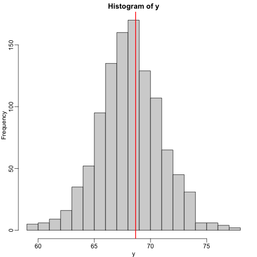
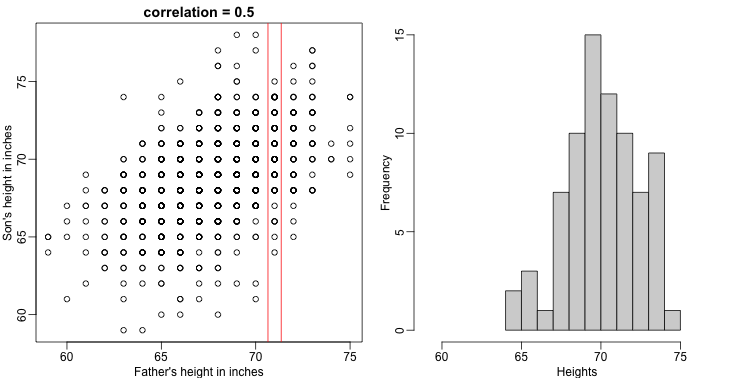
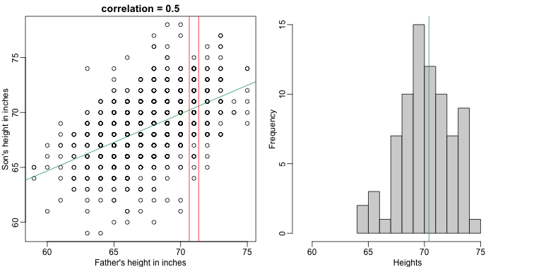

---
# Please do not edit this file directly; it is auto generated.
# Instead, please edit 03-conditional-probabilities-expectations.md in _episodes_rmd/
source: Rmd
title: "Conditional Probabilities and Expectations"
teaching: 30
exercises: 30
questions:
- "?"
objectives:
- "."
keypoints:
- "."
math: yes
---


## Conditional Probabilities and Expectations

Prediction problems can be divided into categorical and continuous outcomes. However, many of the algorithms can be applied to both due to the connection between _conditional probabilities_ and _conditional expectations_. 

For categorical data, for example binary outcomes, if we know the probability of $Y$ being any of the possible outcomes $k$ given a  set of predictors $X=(X_1,\dots,X_p)^\top$, 

$$
f_k(x) = \mbox{Pr}(Y=k \mid X=x)
$$

we can optimize our predictions. Specifically, for any $x$ we predict the $k$ that has the largest probability $f_k(x)$. 

To simplify the exposition below, we will consider the case of binary data. You can think of the probability $\mbox{Pr}(Y=1 \mid X=x)$ as the proportion of 1s in the stratum of the population for which $X=x$. Given that the expectation is the average of all $Y$ values, in this case the expectation is equivalent to the probability: $f(x) \equiv \mbox{E}(Y \mid X=x)=\mbox{Pr}(Y=1 \mid X=x)$. We therefore use only the expectation in the descriptions below as it is more general.

In general, the expected value has an attractive mathematical property, which is that it minimizes the expected distance between the predictor $\hat{Y}$ and $Y$: 

$$
\mbox{E}\{ (\hat{Y} - Y)^2  \mid  X=x \}
$$ 


#### Regression in the context of prediction

<a name="regression"></a>

We use the son and father height example to illustrate how regression can be interpreted as a machine learning technique. In our example, we are trying to predict the son's height $Y$ based on the father's $X$. Here we have only one predictor. Now if we were asked to predict the height of a randomly selected son, we would go with the average height:


```r
library(rafalib)
mypar(1,1)
data(father.son,package="UsingR")
x=round(father.son$fheight) ##round to nearest inch
y=round(father.son$sheight)
hist(y,breaks=seq(min(y),max(y)))
abline(v=mean(y),col="red",lwd=2)
```




In this case, we can also approximate the distribution of $Y$ as normal, which implies the mean maximizes the probability density. 

Let's imagine that we are given more information. We are told that the father of this randomly selected son has a height of 71 inches (1.25 SDs taller than the average). What is our prediction now? 


```r
mypar(1,2)
plot(x,y,xlab="Father's height in inches",ylab="Son's height in inches",
     main=paste("correlation =",signif(cor(x,y),2)))
abline(v=c(-0.35,0.35)+71,col="red")
hist(y[x==71],xlab="Heights",nc=8,main="",xlim=range(y))
```




The best guess is still the expectation, but our strata has changed from all the data, to only the $Y$ with $X=71$. So we can stratify and take the average, which is the conditional expectation. Our prediction for any $x$ is therefore:

$$
f(x) = E(Y \mid X=x)
$$

It turns out that because this data is approximated by a bivariate normal distribution, using calculus, we can show that: 

$$
f(x) = \mu_Y + \rho \frac{\sigma_Y}{\sigma_X} (X-\mu_X)
$$

and if we estimate these five parameters from the sample, we get the regression line:


```r
mypar(1,2)
plot(x,y,xlab="Father's height in inches",ylab="Son's height in inches",
     main=paste("correlation =",signif(cor(x,y),2)))
abline(v=c(-0.35,0.35)+71,col="red")

fit <- lm(y~x)
abline(fit,col=1)

hist(y[x==71],xlab="Heights",nc=8,main="",xlim=range(y))
abline(v = fit$coef[1] + fit$coef[2]*71, col=1)
```




In this particular case, the regression line provides an optimal prediction function for $Y$. But this is not generally true because, in the typical machine learning problems, the optimal $f(x)$ is rarely a simple line.

> ## Exercises
> Throughout these exercises it will be useful to remember that when our data 
> are 0s and 1s, probabilities and expectations are the same thing. We can do 
> the math, but here is some R code:
> 
> ```r
> n = 1000
> y = rbinom(n, 1, 0.25) ## proportion of ones Pr(Y)
> sum(y==1)/length(y) ## expectation of Y mean(y)
> ```
> 1. Generate some random data to imitate heights for men (0) and women (1):
> 
> ```r
> n = 10000
> set.seed(1)
> men = rnorm(n, 176, 7) # height in centimeters 
> women = rnorm(n, 162, 7) # height in centimeters y = c(rep(0, n), rep(1, n))
> x = round(c(men, women))
> ## mix it up
> ind = sample(seq(along=y))
> y = y[ind]
> x = x[ind]
> ```
> 2. Using the data generated above, what is the E(Y | X = 176)?
> 
> > ## Solution
> >
> > 
> > ```r
> > mean(y[x==176])
> > ```
> {: .solution}
{: .challenge}
> 3. Now make a plot of E(Y|X=x) for `x=seq(160, 178)` using the data generated
> in exercise 1.
> If you are predicting female or male based on height and want your probability 
> of success to be larger than 0.5, what is the largest height where you predict 
> female ?
> 
> > ## Solution
> >
> > 
> > ```r
> > mypar()
> > plot(x,y)
> > x_list <- seq(160,178)
> > res <- vector('double', length(x_list))
> > for (i in seq_along(x_list)) {
> >   res[[i]] <- mean(y[x==x_list[[i]]])
> > }
> > ind <- max(which(res > 0.5))
> > x_list[ind] # answer
> > mean(y[x==168])
> > ```
> {: .solution}
{: .challenge}
