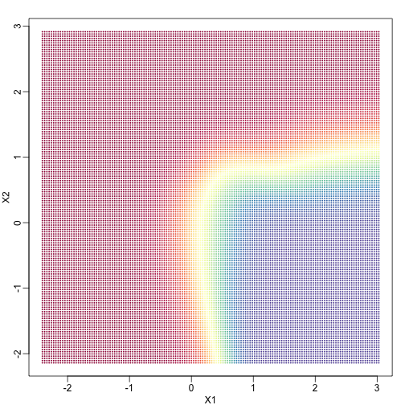
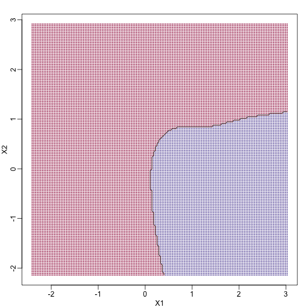
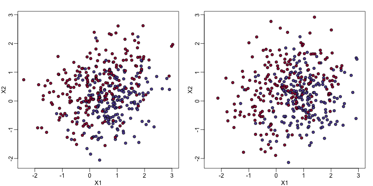
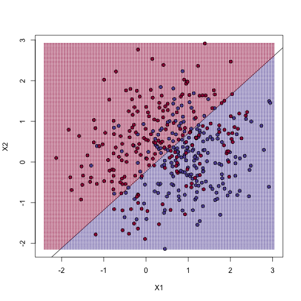
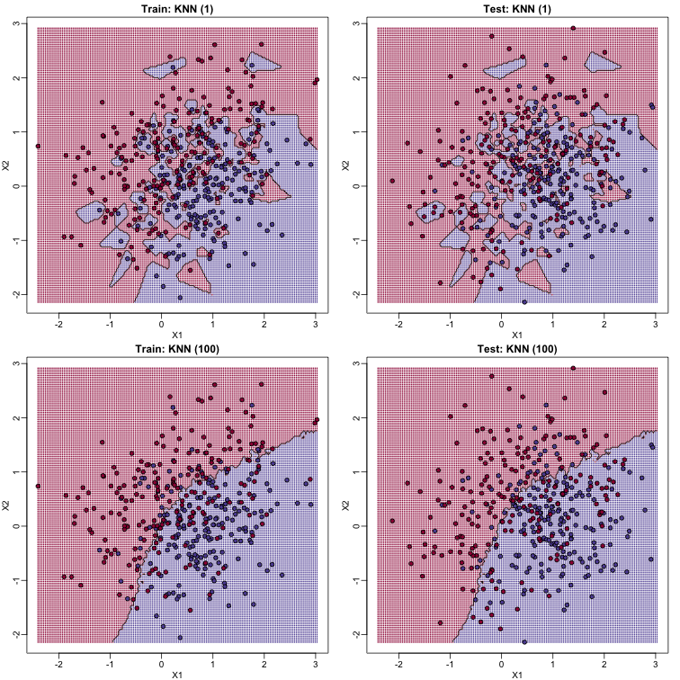
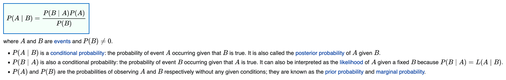
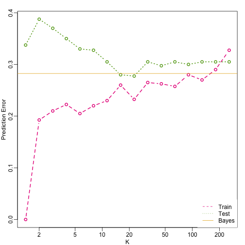

---
# Please do not edit this file directly; it is auto generated.
# Instead, please edit 05-class-prediction.md in _episodes_rmd/
source: Rmd
title: "Class Prediction"
teaching: 30
exercises: 30
questions:
- "What is machine learning (ML)?"
- "Why should we learn ML?"
objectives:
- "In brief, know two major types of ML"
- "Learn training and test data and their relevance"
keypoints:
- "Data quality matters. Garbage in, Garbage out!"
math: yes
---


## Class Prediction

Here we give a brief introduction to the main task of machine learning:
class prediction. In fact, many refer to class prediction as machine
learning and we sometimes use the two terms interchangeably.
We give a very brief introduction to this vast topic, focusing on some specific examples.

Some of the examples we give here are motivated by those in the excellent
textbook *The Elements of Statistical Learning: Data Mining, Inference, and
Prediction*, by Trevor Hastie, Robert Tibshirani and Jerome Friedman,
which can be found [here](http://statweb.stanford.edu/~tibs/ElemStatLearn/).

Similar to inference in the context of regression, Machine Learning (ML) studies the relationships between outcomes $Y$ and covariates $X$. In ML, we call $X$ the predictors or features. The main difference between ML and inference is that, in ML, we are interested mainly in predicting $Y$ using $X$. Statistical models are used, but while in inference we estimate and interpret model parameters, in ML they are mainly a means to an end: predicting $Y$. 

Here we introduce the main concepts needed to understand ML, along with two specific algorithms: regression and k nearest neighbors (kNN). Keep in mind that there are dozens of popular algorithms that we do not cover here.

In a previous section, we covered the very simple one-predictor case. However, most of ML is concerned with cases with more than one predictor. For illustration purposes, we move to a case in which $X$ is two dimensional and $Y$ is binary. We simulate a situation with a non-linear relationship using an example from the Hastie, Tibshirani and Friedman book. In the plot below, we show the actual values of $f(x_1,x_2)=E(Y \mid X_1=x_1,X_2=x_2)$ using colors. The following code is used to create a relatively complex conditional probability function. We create the test and train data we use later (code not shown). Here is the plot of $f(x_1,x_2)$ with red representing values close to 1, blue representing values close to 0, and yellow values in between.




If we show points for which $E(Y \mid X=x)>0.5$ in red and the rest in blue, we see the boundary region that denotes the boundary in which we switch from predicting 0 to 1.




The above plots relate to the "truth" that we do not get to see. Most ML methodology is concerned with estimating $f(x)$. A typical first step is usually to consider a sample, referred to as the training set, to estimate $f(x)$. We will review two specific ML techniques. First, we need to review the main concept we use to evaluate the performance of these methods. 

#### Training and test sets

Let's download and then load RData file that will enable us to run following code.
[Download ml-biomed-classpredict-setup-20221019.RData](https://go.sbamin.com/1YMJ).
It should be around 41.5 MB (with md5 checksum of *6cabda5d1e0600db885a602094697708*).
Once you have RData file on your computer, open up RStudio and run following:


```r
## Load R packages given in Setup file ----
print("Loading Setup")
```

```
## [1] "Loading Setup"
```

```r
library(devtools)
```

```
## Loading required package: usethis
```

```
## 
## Attaching package: 'devtools'
```

```
## The following object is masked from 'package:rafalib':
## 
##     install_bioc
```

```r
library(rafalib)
library(RColorBrewer)
library(gplots)
```

```
## 
## Attaching package: 'gplots'
```

```
## The following object is masked from 'package:stats':
## 
##     lowess
```

```r
library(class)
library(caret)
```

```
## Loading required package: ggplot2
```

```
## Loading required package: lattice
```

```r
library(tissuesGeneExpression) 
data(tissuesGeneExpression)

library(genefilter)
```

```
## 
## Attaching package: 'genefilter'
```

```
## The following object is masked from 'package:MASS':
## 
##     area
```

```r
library(Biobase)
```

```
## Loading required package: BiocGenerics
```

```
## 
## Attaching package: 'BiocGenerics'
```

```
## The following objects are masked from 'package:stats':
## 
##     IQR, mad, sd, var, xtabs
```

```
## The following objects are masked from 'package:base':
## 
##     anyDuplicated, append, as.data.frame, basename, cbind, colnames,
##     dirname, do.call, duplicated, eval, evalq, Filter, Find, get, grep,
##     grepl, intersect, is.unsorted, lapply, Map, mapply, match, mget,
##     order, paste, pmax, pmax.int, pmin, pmin.int, Position, rank,
##     rbind, Reduce, rownames, sapply, setdiff, sort, table, tapply,
##     union, unique, unsplit, which.max, which.min
```

```
## Welcome to Bioconductor
## 
##     Vignettes contain introductory material; view with
##     'browseVignettes()'. To cite Bioconductor, see
##     'citation("Biobase")', and for packages 'citation("pkgname")'.
```

```r
library(SpikeIn)
```

```
## Loading required package: affy
```

```r
library(hgu95acdf)
```

```
## Warning: replacing previous import 'AnnotationDbi::tail' by 'utils::tail' when
## loading 'hgu95acdf'
```

```
## Warning: replacing previous import 'AnnotationDbi::head' by 'utils::head' when
## loading 'hgu95acdf'
```

```
## 
```

```r
data(SpikeIn95)

print("Finished Loading Setup")
```

```
## [1] "Finished Loading Setup"
```

```r
print("Print sessionInfo()")
```

```
## [1] "Print sessionInfo()"
```

```r
print(devtools::session_info())
```

```
## ─ Session info ────────────────────────────────────────────────────────────────────────────────────────────────────────────────────────────────────────
##  setting  value
##  version  R version 4.1.3 (2022-03-10)
##  os       macOS Big Sur/Monterey 10.16
##  system   x86_64, darwin17.0
##  ui       X11
##  language (EN)
##  collate  en_US.UTF-8
##  ctype    en_US.UTF-8
##  tz       America/New_York
##  date     2022-10-19
##  pandoc   2.12 @ /opt/anaconda3/bin/pandoc
## 
## ─ Packages ────────────────────────────────────────────────────────────────────────────────────────────────────────────────────────────────────────────
##  package               * version    date (UTC) lib source
##  affy                  * 1.72.0     2021-10-26 [2] Bioconductor
##  affyio                  1.64.0     2021-10-26 [2] Bioconductor
##  annotate                1.72.0     2021-10-26 [2] Bioconductor
##  AnnotationDbi           1.56.2     2021-11-09 [2] Bioconductor
##  assertthat              0.2.1      2019-03-21 [2] CRAN (R 4.1.0)
##  Biobase               * 2.54.0     2021-10-26 [2] Bioconductor
##  BiocGenerics          * 0.40.0     2021-10-26 [2] Bioconductor
##  BiocManager             1.30.18    2022-05-18 [1] CRAN (R 4.1.2)
##  Biostrings              2.62.0     2021-10-26 [2] Bioconductor
##  bit                     4.0.4      2020-08-04 [2] CRAN (R 4.1.0)
##  bit64                   4.0.5      2020-08-30 [2] CRAN (R 4.1.0)
##  bitops                  1.0-7      2021-04-24 [2] CRAN (R 4.1.0)
##  blob                    1.2.3      2022-04-10 [2] CRAN (R 4.1.3)
##  cachem                  1.0.6      2021-08-19 [2] CRAN (R 4.1.0)
##  callr                   3.7.2      2022-08-22 [1] CRAN (R 4.1.3)
##  caret                 * 6.0-93     2022-08-09 [1] CRAN (R 4.1.2)
##  caTools                 1.18.2     2021-03-28 [1] CRAN (R 4.1.0)
##  class                 * 7.3-20     2022-01-13 [1] CRAN (R 4.1.2)
##  cli                     3.4.1      2022-09-23 [1] CRAN (R 4.1.3)
##  codetools               0.2-18     2020-11-04 [2] CRAN (R 4.1.3)
##  colorspace              2.0-3      2022-02-21 [2] CRAN (R 4.1.2)
##  crayon                  1.5.2      2022-09-29 [1] CRAN (R 4.1.3)
##  data.table              1.14.4     2022-10-17 [1] CRAN (R 4.1.3)
##  DBI                     1.1.3      2022-06-18 [2] CRAN (R 4.1.2)
##  devtools              * 2.4.5      2022-10-11 [1] CRAN (R 4.1.2)
##  digest                  0.6.30     2022-10-18 [1] CRAN (R 4.1.3)
##  dplyr                   1.0.10     2022-09-01 [1] CRAN (R 4.1.3)
##  ellipsis                0.3.2      2021-04-29 [2] CRAN (R 4.1.0)
##  evaluate                0.17       2022-10-07 [1] CRAN (R 4.1.2)
##  fansi                   1.0.3      2022-03-24 [2] CRAN (R 4.1.3)
##  fastmap                 1.1.0      2021-01-25 [2] CRAN (R 4.1.0)
##  foreach                 1.5.2      2022-02-02 [1] CRAN (R 4.1.2)
##  fs                      1.5.2      2021-12-08 [2] CRAN (R 4.1.0)
##  future                  1.28.0     2022-09-02 [1] CRAN (R 4.1.2)
##  future.apply            1.9.1      2022-09-07 [1] CRAN (R 4.1.3)
##  genefilter            * 1.76.0     2021-10-26 [1] Bioconductor
##  generics                0.1.3      2022-07-05 [2] CRAN (R 4.1.3)
##  GenomeInfoDb            1.30.1     2022-01-30 [2] Bioconductor
##  GenomeInfoDbData        1.2.7      2022-06-06 [2] Bioconductor
##  ggplot2               * 3.3.6      2022-05-03 [2] CRAN (R 4.1.2)
##  globals                 0.16.1     2022-08-28 [1] CRAN (R 4.1.3)
##  glue                    1.6.2      2022-02-24 [2] CRAN (R 4.1.2)
##  gower                   1.0.0      2022-02-03 [1] CRAN (R 4.1.2)
##  gplots                * 3.1.3      2022-04-25 [1] CRAN (R 4.1.2)
##  gtable                  0.3.1      2022-09-01 [1] CRAN (R 4.1.3)
##  gtools                  3.9.3      2022-07-11 [1] CRAN (R 4.1.2)
##  hardhat                 1.2.0      2022-06-30 [1] CRAN (R 4.1.2)
##  hgu95acdf             * 2.18.0     2022-07-18 [1] Bioconductor
##  highr                   0.9        2021-04-16 [2] CRAN (R 4.1.0)
##  htmltools               0.5.3      2022-07-18 [1] CRAN (R 4.1.3)
##  htmlwidgets             1.5.4      2021-09-08 [2] CRAN (R 4.1.0)
##  httpuv                  1.6.6      2022-09-08 [1] CRAN (R 4.1.2)
##  httr                    1.4.4      2022-08-17 [1] CRAN (R 4.1.3)
##  ipred                   0.9-13     2022-06-02 [1] CRAN (R 4.1.2)
##  IRanges                 2.28.0     2021-10-26 [2] Bioconductor
##  iterators               1.0.14     2022-02-05 [1] CRAN (R 4.1.2)
##  KEGGREST                1.34.0     2021-10-26 [2] Bioconductor
##  KernSmooth              2.23-20    2021-05-03 [2] CRAN (R 4.1.3)
##  knitr                 * 1.40       2022-08-24 [1] CRAN (R 4.1.3)
##  later                   1.3.0      2021-08-18 [1] CRAN (R 4.1.0)
##  lattice               * 0.20-45    2021-09-22 [2] CRAN (R 4.1.3)
##  lava                    1.6.10     2021-09-02 [1] CRAN (R 4.1.0)
##  lifecycle               1.0.3      2022-10-07 [1] CRAN (R 4.1.2)
##  listenv                 0.8.0      2019-12-05 [1] CRAN (R 4.1.0)
##  lubridate               1.8.0      2021-10-07 [2] CRAN (R 4.1.0)
##  magrittr                2.0.3      2022-03-30 [2] CRAN (R 4.1.3)
##  MASS                  * 7.3-57     2022-04-22 [2] CRAN (R 4.1.2)
##  Matrix                  1.4-1      2022-03-23 [2] CRAN (R 4.1.2)
##  memoise                 2.0.1      2021-11-26 [2] CRAN (R 4.1.0)
##  mime                    0.12       2021-09-28 [2] CRAN (R 4.1.0)
##  miniUI                  0.1.1.1    2018-05-18 [1] CRAN (R 4.1.0)
##  ModelMetrics            1.2.2.2    2020-03-17 [1] CRAN (R 4.1.0)
##  munsell                 0.5.0      2018-06-12 [2] CRAN (R 4.1.0)
##  nlme                    3.1-158    2022-06-15 [2] CRAN (R 4.1.2)
##  nnet                    7.3-17     2022-01-16 [2] CRAN (R 4.1.3)
##  parallelly              1.32.1     2022-07-21 [1] CRAN (R 4.1.2)
##  pillar                  1.8.1      2022-08-19 [1] CRAN (R 4.1.3)
##  pkgbuild                1.3.1      2021-12-20 [2] CRAN (R 4.1.0)
##  pkgconfig               2.0.3      2019-09-22 [2] CRAN (R 4.1.0)
##  pkgload                 1.3.0      2022-06-27 [2] CRAN (R 4.1.2)
##  plyr                    1.8.7      2022-03-24 [2] CRAN (R 4.1.2)
##  png                     0.1-7      2013-12-03 [2] CRAN (R 4.1.0)
##  preprocessCore          1.56.0     2021-10-26 [2] Bioconductor
##  prettyunits             1.1.1      2020-01-24 [2] CRAN (R 4.1.0)
##  pROC                    1.18.0     2021-09-03 [1] CRAN (R 4.1.0)
##  processx                3.7.0      2022-07-07 [2] CRAN (R 4.1.3)
##  prodlim                 2019.11.13 2019-11-17 [1] CRAN (R 4.1.0)
##  profvis                 0.3.7      2020-11-02 [1] CRAN (R 4.1.0)
##  promises                1.2.0.1    2021-02-11 [1] CRAN (R 4.1.0)
##  ps                      1.7.1      2022-06-18 [2] CRAN (R 4.1.2)
##  purrr                   0.3.5      2022-10-06 [1] CRAN (R 4.1.2)
##  R6                      2.5.1      2021-08-19 [2] CRAN (R 4.1.0)
##  rafalib               * 1.0.0      2015-08-09 [1] CRAN (R 4.1.0)
##  RColorBrewer          * 1.1-3      2022-04-03 [1] CRAN (R 4.1.2)
##  Rcpp                    1.0.9      2022-07-08 [1] CRAN (R 4.1.2)
##  RCurl                   1.98-1.9   2022-10-03 [1] CRAN (R 4.1.2)
##  recipes                 1.0.2      2022-10-16 [1] CRAN (R 4.1.3)
##  remotes                 2.4.2      2021-11-30 [1] CRAN (R 4.1.0)
##  reshape2                1.4.4      2020-04-09 [2] CRAN (R 4.1.0)
##  rlang                   1.0.6      2022-09-24 [1] CRAN (R 4.1.2)
##  rpart                   4.1.16     2022-01-24 [2] CRAN (R 4.1.3)
##  RSQLite                 2.2.18     2022-10-04 [1] CRAN (R 4.1.2)
##  S4Vectors               0.32.4     2022-03-29 [2] Bioconductor
##  scales                  1.2.1      2022-08-20 [1] CRAN (R 4.1.2)
##  sessioninfo             1.2.2      2021-12-06 [2] CRAN (R 4.1.0)
##  shiny                   1.7.2      2022-07-19 [1] CRAN (R 4.1.2)
##  SpikeIn               * 1.36.0     2021-10-30 [1] Bioconductor
##  stringi                 1.7.8      2022-07-11 [1] CRAN (R 4.1.3)
##  stringr                 1.4.1      2022-08-20 [1] CRAN (R 4.1.2)
##  survival                3.3-1      2022-03-03 [2] CRAN (R 4.1.2)
##  tibble                  3.1.8      2022-07-22 [1] CRAN (R 4.1.2)
##  tidyselect              1.2.0      2022-10-10 [1] CRAN (R 4.1.2)
##  timeDate                4021.106   2022-09-30 [1] CRAN (R 4.1.2)
##  tissuesGeneExpression * 1.0        2022-07-01 [2] Github (genomicsclass/tissuesGeneExpression@a43cf4b)
##  urlchecker              1.0.1      2021-11-30 [1] CRAN (R 4.1.0)
##  usethis               * 2.1.6      2022-05-25 [2] CRAN (R 4.1.3)
##  utf8                    1.2.2      2021-07-24 [2] CRAN (R 4.1.0)
##  vctrs                   0.4.2      2022-09-29 [1] CRAN (R 4.1.3)
##  withr                   2.5.0      2022-03-03 [2] CRAN (R 4.1.2)
##  xfun                    0.34       2022-10-18 [1] CRAN (R 4.1.3)
##  XML                     3.99-0.11  2022-10-03 [1] CRAN (R 4.1.2)
##  xtable                  1.8-4      2019-04-21 [2] CRAN (R 4.1.0)
##  XVector                 0.34.0     2021-10-26 [2] Bioconductor
##  zlibbioc                1.40.0     2021-10-26 [2] Bioconductor
## 
##  [1] /Users/smc/Library/R/x86_64/4.1/library
##  [2] /Library/Frameworks/R.framework/Versions/4.1/Resources/library
## 
## ───────────────────────────────────────────────────────────────────────────────────────────────────────────────────────────────────────────────────────
```

Now load RData file you just downloaded above. Note that path to
ml-biomed-classpredict-setup-20221019.RData may differ depending on where you have
placed RData file. Adjust path accordingly in the command below.


```r
## locate where your working dir is first.
## that can help you identify relative path of RData file.
getwd()
```

```
## [1] "/Users/smc/Projects/Lessons/machine-learning-for-biomedical-science/_episodes_rmd"
```

```r
load("data/ml-biomed-classpredict-setup-20221019.RData")
```

```
## Warning in readChar(con, 5L, useBytes = TRUE): cannot open compressed file
## 'data/ml-biomed-classpredict-setup-20221019.RData', probable reason 'No such
## file or directory'
```

```
## Error in readChar(con, 5L, useBytes = TRUE): cannot open the connection
```

```r
## now list available R objects that we can use for class prediction code below
ls()
```

```
##  [1] "args"      "bayesrule" "cols"      "colshat"   "colstest"  "dest_md"  
##  [7] "GS"        "hmcol"     "M0"        "M1"        "makeX"     "mycols"   
## [13] "N"         "newx"      "op"        "p"         "s"         "s2"       
## [19] "src_rmd"   "test"      "testx0"    "testx1"    "tmpx"      "tmpy"     
## [25] "x"         "x0"        "x1"        "XLIM"      "y"         "YLIM"     
## [31] "ytest"
```

In the code (not shown) for the first plot in this chapter, we created a test and a training set. We plot them here:


```r
#x, test, cols, and coltest were created in code that was not shown
#x is training x1 and x2, test is test x1 and x2
#cols (0=blue, 1=red) are training observations
#coltests are test observations
mypar(1,2)
plot(x,pch=21,bg=cols,xlab="X1",ylab="X2",xlim=XLIM,ylim=YLIM)
plot(test,pch=21,bg=colstest,xlab="X1",ylab="X2",xlim=XLIM,ylim=YLIM)
```




You will notice that the test and train set have similar global properties since they were generated by the same random variables (more blue towards the bottom right), but are, by construction, different. **The reason we create test and training sets** is to detect over-training by testing on a different data than the one used to fit models or train algorithms. We will see how important this is below.

#### Predicting with regression

A first naive approach to this ML problem is to fit a **two variable linear regression model**:


```r
##x and y were created in the code (not shown) for the first plot
#y is outcome for the training set
X1 <- x[,1] ##these are the covariates
X2 <- x[,2] 
fit1 <- lm(y~X1+X2)

## get summary of a fitted model
summary(fit1)
```

```
## 
## Call:
## lm(formula = y ~ X1 + X2)
## 
## Residuals:
##      Min       1Q   Median       3Q      Max 
## -0.99350 -0.36244  0.00274  0.37927  0.92329 
## 
## Coefficients:
##             Estimate Std. Error t value Pr(>|t|)    
## (Intercept)  0.55305    0.02559  21.608  < 2e-16 ***
## X1          -0.20902    0.02378  -8.790  < 2e-16 ***
## X2           0.22230    0.02610   8.517 3.42e-16 ***
## ---
## Signif. codes:  0 '***' 0.001 '**' 0.01 '*' 0.05 '.' 0.1 ' ' 1
## 
## Residual standard error: 0.4382 on 397 degrees of freedom
## Multiple R-squared:  0.2377,	Adjusted R-squared:  0.2339 
## F-statistic: 61.91 on 2 and 397 DF,  p-value: < 2.2e-16
```

Once we the have fitted values, we can estimate $f(x_1,x_2)$ with $\hat{f}(x_1,x_2)=\hat{\beta}_0 + \hat{\beta}_1x_1 +\hat{\beta}_2 x_2$. To provide an actual prediction, we simply predict 1 when $\hat{f}(x_1,x_2)>0.5$. We now examine the error rates in the test and training sets and also plot the boundary region:


```r
##prediction on train
yhat <- predict(fit1)
yhat <- as.numeric(yhat>0.5)
cat("Linear regression prediction error in train:",1-mean(yhat==y),"\n")
```

```
## Linear regression prediction error in train: 0.2975
```

We can quickly obtain predicted values for any set of values using the `predict` function:


```r
yhat <- predict(fit1,newdata=data.frame(X1=newx[,1],X2=newx[,2]))
```

Now we can create a plot showing where we predict 1s and where we predict 0s, as well as the boundary. We can also use the `predict` function to obtain predicted values for our test set. **Note that nowhere do we fit the model on the test set:** 


```r
colshat <- yhat
colshat[yhat>=0.5] <- mycols[2]
colshat[yhat<0.5] <- mycols[1]
m <- -fit1$coef[2]/fit1$coef[3] #boundary slope
b <- (0.5 - fit1$coef[1])/fit1$coef[3] #boundary intercept

##prediction on test
yhat <- predict(fit1,newdata=data.frame(X1=test[,1],X2=test[,2]))
yhat <- as.numeric(yhat>0.5)
cat("Linear regression prediction error in test:",1-mean(yhat==ytest),"\n")
```

```
## Linear regression prediction error in test: 0.32
```

```r
plot(test,type="n",xlab="X1",ylab="X2",xlim=XLIM,ylim=YLIM)
abline(b,m)
points(newx,col=colshat,pch=16,cex=0.35)

##test was created in the code (not shown) for the first plot
points(test,bg=cols,pch=21)
```




The error rates in the test and train sets are quite similar. Thus, we do not seem to be over-training. This is not surprising as we are fitting a 2 parameter model to 400 data points. However, note that the boundary is a line. Because we are fitting a plane to the data, there is no other option here. **The linear regression method is too rigid.** The rigidity makes it stable and avoids over-training, but it also keeps the model from adapting to the non-linear relationship between $Y$ and $X$. We saw this before in the smoothing section. The next ML technique we consider is similar to the smoothing techniques described before.

<a name="knn"></a>

#### K-nearest neighbor

K-nearest neighbors (kNN) is similar to bin smoothing, but it is easier to adapt to multiple dimensions. Basically, for any point $x$ for which we want an estimate, we look for the k nearest points and then take an average of these points. This gives us an estimate of $f(x_1,x_2)$, just like the bin smoother gave us an estimate of a curve. We can now control flexibility through $k$. Here we compare $k=1$ and $k=100$.


```r
library(class)
mypar(2,2)
for(k in c(1,100)){
  ##predict on train
  yhat <- knn(x,x,y,k=k)
  cat("KNN prediction error in train:",1-mean((as.numeric(yhat)-1)==y),"\n")
  ##make plot
  yhat <- knn(x,test,y,k=k)
  cat("KNN prediction error in test:",1-mean((as.numeric(yhat)-1)==ytest),"\n")
}
```

```
## KNN prediction error in train: 0 
## KNN prediction error in test: 0.3375 
## KNN prediction error in train: 0.2725 
## KNN prediction error in test: 0.3125
```

To visualize why we make no errors in the train set and many errors in the test set when $k=1$ and obtain more stable results from $k=100$, we show the prediction regions (code not shown):




When $k=1$, we make no mistakes in the training test since every point is its closest neighbor and it is equal to itself. However, we see some islands of blue in the red area that, once we move to the test set, are more error prone. In the case $k=100$, we do not have this problem and we also see that we improve the error rate over linear regression. We can also see that our estimate of $f(x_1,x_2)$ is closer to the truth.

#### Bayes rule



Here we include a comparison of the test and train set errors for various values of $k$. We also include the error rate that we would make if we actually knew $\mbox{E}(Y \mid X_1=x1,X_2=x_2)$ referred to as _Bayes Rule_.

We start by computing the error rates...


```r
###Bayes Rule
yhat <- apply(test,1,p)
cat("Bayes rule prediction error in train",1-mean(round(yhat)==y),"\n")
```

```
## Bayes rule prediction error in train 0.2825
```

```r
bayes.error=1-mean(round(yhat)==y)
train.error <- rep(0,16)
test.error <- rep(0,16)
for(k in seq(along=train.error)){
  ##predict on train
  yhat <- knn(x,x,y,k=2^(k/2))
  train.error[k] <- 1-mean((as.numeric(yhat)-1)==y)
  ##prediction on test    
  yhat <- knn(x,test,y,k=2^(k/2))
  test.error[k] <- 1-mean((as.numeric(yhat)-1)==y)
}
```

... and then plot the error rates against values of $k$. We also show the Bayes rules error rate as a horizontal line.


```r
ks <- 2^(seq(along=train.error)/2)
mypar()
plot(ks,train.error,type="n",xlab="K",ylab="Prediction Error",log="x",
     ylim=range(c(test.error,train.error)))
lines(ks,train.error,type="b",col=4,lty=2,lwd=2)
lines(ks,test.error,type="b",col=5,lty=3,lwd=2)
abline(h=bayes.error,col=6)
legend("bottomright",c("Train","Test","Bayes"),col=c(4,5,6),lty=c(2,3,1),box.lwd=0)
```




Note that these error rates are random variables and have standard errors. In the next section we describe cross-validation which helps reduce some of this variability. However, even with this variability, the plot clearly shows the problem of over-fitting when using values lower than 20 and under-fitting with values above 100.
