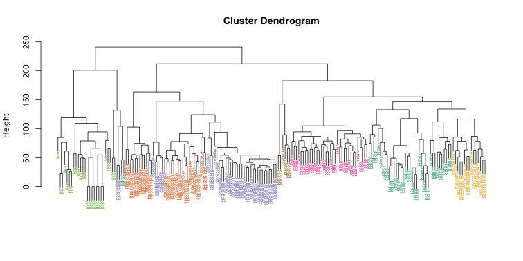
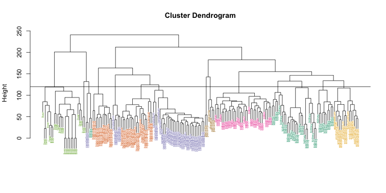
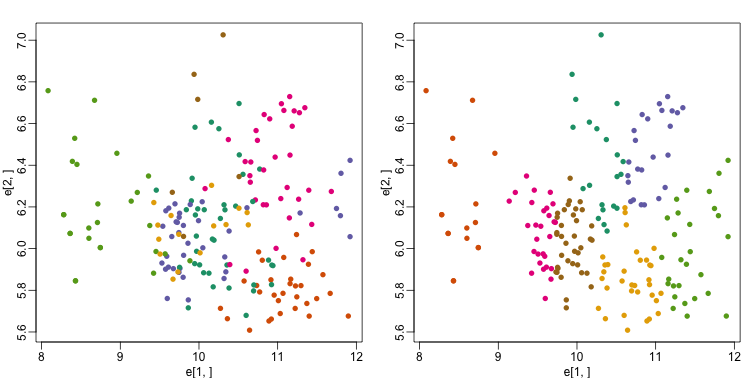
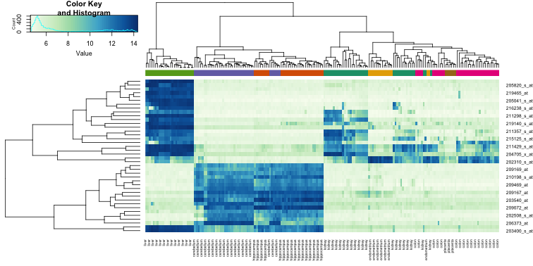

```{r, include=FALSE}
source("../bin/chunk-options.R")
knitr_fig_path("02-")
```

## Clustering 

We will demonstrate the concepts and code needed to perform clustering analysis with the tissue gene expression data:

```{r}
library(tissuesGeneExpression)
data(tissuesGeneExpression)
```

To illustrate the main application of clustering in the life sciences, let's pretend that we don't know these are different tissues and are interested in clustering. The first step is to compute the distance between each sample:

```{r}
d <- dist( t(e) )
```

<a name="hierarchical"></a>

#### Hierarchical clustering

With the distance between each pair of samples computed, we need clustering algorithms to join them into groups. Hierarchical clustering is one of the many clustering algorithms available to do this. Each sample is assigned to its own group and then the algorithm continues iteratively, joining the two most similar clusters at each step, and continuing until there is just one group. While we have defined distances between samples, we have not yet defined distances between groups. There are various ways this can be done and they all rely on the individual pairwise distances. The helpfile for `hclust` includes detailed information. 

We can perform hierarchical clustering based on the distances defined above using the `hclust` function. This function returns an `hclust` object that describes the groupings that were created using the algorithm described above. The `plot` method represents these relationships with a tree or dendrogram: 

```{r dendrogram, fig.cap="Dendrogram showing hierarchical clustering of tissue gene expression data.",fig.width=10.5,fig.height=5.25}
library(rafalib)
mypar()
hc <- hclust(d)
hc
plot(hc,labels=tissue,cex=0.5)
```


Does this technique "discover" the clusters defined by the different tissues? In this plot, it is not easy to see the different tissues so we add colors by using the `myplclust` function from the `rafalib` package. 
 
```{r color_dendrogram, fig.cap="Dendrogram showing hierarchical clustering of tissue gene expression data with colors denoting tissues.",fig.width=10.5,fig.height=5.25}
myplclust(hc, labels=tissue, lab.col=as.fumeric(tissue), cex=0.5)
```



Visually, it does seem as if the clustering technique has discovered the tissues. However,  hierarchical clustering does not define specific clusters, but rather defines the dendrogram above. From the dendrogram we can decipher the distance between any two groups by looking at the height at which the two groups split into two. To define clusters, we need to "cut the tree" at some distance and group all samples that are within that distance into groups below. To visualize this, we draw a horizontal line at the height we wish to cut and this defines that line. We use 120 as an example:

```{r color_dendrogram2, fig.cap="Dendrogram showing hierarchical clustering of tissue gene expression data with colors denoting tissues. Horizontal line defines actual clusters.",fig.width=10.5,fig.height=5.25}
myplclust(hc, labels=tissue, lab.col=as.fumeric(tissue),cex=0.5)
abline(h=120)
```


If we use the line above to cut the tree into clusters, we can examine how the clusters overlap with the actual tissues:

```{r}
hclusters <- cutree(hc, h=120)
table(true=tissue, cluster=hclusters)
```

We can also ask `cutree` to give us back a given number of clusters. The function then automatically finds the height that results in the requested number of clusters:

```{r}
hclusters <- cutree(hc, k=8)
table(true=tissue, cluster=hclusters)
```

In both cases we do see that, with some exceptions, each tissue is uniquely represented by one of the clusters. In some instances, the one tissue is spread across two tissues, which is due to selecting too many clusters. Selecting the number of clusters is generally a challenging step in practice and an active area of research.

<a name="kmeans"></a>

#### K-means

We can also cluster with the `kmeans` function to perform k-means clustering. As an example, let's run k-means on the samples in the space of the first two genes:

```{r kmeans, fig.cap="Plot of gene expression for first two genes (order of appearance in data) with color representing tissue (left) and clusters found with kmeans (right).",fig.width=10.5,fig.height=5.25}
set.seed(1)
km <- kmeans(t(e[1:2,]), centers=7)
names(km)

mypar(1,2)
plot(e[1,], e[2,], col=as.fumeric(tissue), pch=16)
plot(e[1,], e[2,], col=km$cluster, pch=16)
```



In the first plot, color represents the actual tissues, while in the second, color represents the clusters that were defined by `kmeans`. We can see from tabulating the results that this particular clustering exercise did not perform well:

```{r}
table(true=tissue,cluster=km$cluster)
```

This is very likely due to the fact that the first two genes are not informative regarding tissue type. We can see this in the first plot above. If we instead perform k-means clustering using all of the genes, we obtain a much improved result. To visualize this, we can use an MDS plot:


```{r kmeans_mds, fig.cap="Plot of gene expression for first two PCs with color representing tissues (left) and clusters found using all genes (right).",fig.width=10.5,fig.height=5.25}
km <- kmeans(t(e), centers=7)
mds <- cmdscale(d)

mypar(1,2)
plot(mds[,1], mds[,2]) 
plot(mds[,1], mds[,2], col=km$cluster, pch=16)
```


By tabulating the results, we see that we obtain a similar answer to that obtained with hierarchical clustering.

```{r}
table(true=tissue,cluster=km$cluster)
```


<a name="heatmap"></a>

#### Heatmaps

Heatmaps are ubiquitous in the genomics literature. They are very useful plots for visualizing the measurements for a subset of rows over all the samples. A *dendrogram* is added on top and on the side that is created with hierarchical clustering. We will demonstrate how to create heatmaps from within R. Let's begin by defining a color palette:

```{r}
library(RColorBrewer) 
hmcol <- colorRampPalette(brewer.pal(9, "GnBu"))(100)
```

Now, pick the genes with the top variance over all samples:

```{r, message=FALSE}
library(genefilter)
rv <- rowVars(e)
idx <- order(-rv)[1:40]
```

While a `heatmap` function is included in R, we recommend the `heatmap.2` function from the `gplots` package on CRAN because it is a bit more customized. For example, it stretches to fill the window. Here we add colors to indicate the tissue on the top:

```{r heatmap.2,message=FALSE,fig.cap="Heatmap created using the 40 most variable genes and the function heatmap.2.", fig.width=10.5,fig.height=5.25}

library(gplots) ##Available from CRAN
cols <- palette(brewer.pal(8, "Dark2"))[as.fumeric(tissue)]
head(cbind(colnames(e),cols))
heatmap.2(e[idx,], labCol=tissue,
          trace="none", 
          ColSideColors=cols, 
          col=hmcol)
```



We did not use tissue information to create this heatmap, and we can quickly see, with just 40 genes, good separation across tissues.

> ## Exercises
> 1. Create a random matrix with no correlation in the following way:
> ```{r, eval=FALSE}
> set.seed(1)
> m = 10000
> n = 24
> x = matrix(rnorm(m * n), m, n) 
> colnames(x) = 1:n
> ```
> Run hierarchical clustering on this data with the `hclust` function with 
> default parameters to cluster the columns. Create a dendrogram.  
> In the dendrogram, which pairs of samples are the furthest away from each 
> other?  
> A) 7 and 23  
> B) 19 and 14  
> C) 1 and 16  
> D) 17 and 18  
> 
> > ## Solution
> >
> > ```{r, eval=FALSE}
> > d <- dist(t(x))
> > hc <- hclust(d)
> > mypar()
> > plot(hc)
> > ```
> > # 7 and 23 - 141  
> > # 19 and 14 - 143  
> > # 1 and 16 - 142  
> > # 17 and 18 - 142  
> > The answer is B: 19 and 14. The answer might be different due to the random 
> > numbers.
> {: .solution}
{: .challenge}

> 2. Set the seed at 1, `set.seed(1)` and replicate the creation of this matrix
> 100 times:
> ```{r, eval=FALSE}
> m = 10000
> n = 24
> x = matrix(rnorm(m * n), m, n)
> ```
> then perform hierarchical clustering as in the solution to exercise 1, and 
> find the number of clusters if you use `cuttree` at height 143. This number is 
> a random variable.
> Based on the Monte Carlo simulation, what is the standard error of this random 
> variable?
> 
> > ## Solution
> >
> > ```{r, eval=FALSE}
> > set.seed(1)
> > res_list <- replicate(100, {
> >   m = 10000
> >   n = 24
> >   x = matrix(rnorm(m * n), m, n)
> >   d <- dist(t(x))
> >   hc <- hclust(d)
> >   hclusters <- cutree(hc, h=143)
> >   num_clus <- length(unique(hclusters))
> >   return(num_clus)
> > })
> > popsd(res_list)
> > ```
> {: .solution}
{: .challenge}
> 3. Run `kmeans` with 4 centers for the blood RNA data:
> ```{r, eval=FALSE}
> library(GSE5859Subset)
> data(GSE5859Subset)
> ```
> Set the seed to 10, `set.seed(10)` right before running kmeans with 5 centers.
> Explore the relationship of clusters and information in `sampleInfo`. Which of 
> the following best describes what you find?
> A) `sampleInfo$group` is driving the clusters as the 0s and 1s are in 
> completely different clusters.
> B) The year is driving the clusters.
> C) `Date` is driving the clusters.
> D) The clusters don’t depend on any of the column of `sampleInfo`
> 
> > ## Solution
> >
> > ```{r, eval=FALSE}
> > km <- kmeans(t(geneExpression), centers = 5)
> > km$cluster
> > table(true = sampleInfo$group, cluster = km$cluster)
> > table(true = sampleInfo$date, cluster = km$cluster)
> > ```
> > The answer is C: Date is driving the clusters.
> {: .solution}
{: .challenge}
> 4. Load the data:
> ```{r, eval=FALSE}
> library(GSE5859Subset)
> data(GSE5859Subset)
> ```
> Pick the 25 genes with the highest across sample variance. This function might 
> help:
> ```{r, eval=FALSE}
> install.packages("matrixStats") 
> library(matrixStats)
> ?rowMads ## we use mads due to a outlier sample
> ```
> Use `heatmap.2` to make a heatmap showing the `sampleInfo$group` with color, 
> the date as labels, the rows labelled with chromosome, and scaling the rows.
> What do we learn from this heatmap?
> A) The data appears as if it was generated by `rnorm`.  
> B) Some genes in chr1 are very variable.  
> C) A group of chrY genes are higher in group 0 and appear to drive the 
> clustering. Within those clusters there appears to be clustering by `month`.  
> D) A group of chrY genes are higher in October compared to June and appear
> to drive the clustering. Within those clusters there appears to be clustering 
> by `samplInfo$group`.  
> 
> > ## Solution
> >
> > ```{r, eval=FALSE}
> > hmcol <- colorRampPalette(brewer.pal(9, "GnBu"))(100)
> > month = format( sampleInfo$date, "%m")
> > rv <- rowVars(geneExpression)
> > idx <- order(-rv)[1:25]
> > cols <- palette(brewer.pal(8, "Dark2"))[as.fumeric(as.character(sampleInfo$group))]
> > 
> > heatmap.2(geneExpression[idx,], 
> >           trace = 'none', labRow = geneAnnotation[idx,]$CHR,
> >           col = hmcol, labCol = month,
> >           ColSideColors = cols)
> > ```
> > The correct answer is C: A group of chrY genes are higher in group 0 and 
> > appear to drive the clustering. Within those clusters there appears to be 
> > clustering by month.
> > Answer A is wrong because if the data were generated by `norm`, the color 
> > distribution of the heatmap would be entirely random. Answer B is wrong 
> > because the colors in the row chr1 are more or less the same except for one 
> > column (one sample). Answer D is wrong chrY genes are higher in June, not 
> > October.
> {: .solution}
{: .challenge}
> 5. Create a large dataset of random data that is completely independent of
> `sampleInfo$group` like this:
> ```{r, eval=FALSE}
> set.seed(17)
> m = nrow(geneExpression) 
> n = ncol(geneExpression) 
> x = matrix(rnorm(m * n), m, n) 
> g = factor(sampleInfo$g)
> ```
> Create two heatmaps with these data. Show the group `g` either with labels or 
> colors. First, take the 50 genes with smallest p-values obtained with 
> `rowttests`. Then, take the 50 genes with largest standard deviations.
> Which of the following statements is true?  
> A) There is no relationship between `g` and `x`, but with 8,793 tests some 
> will appear significant by chance. Selecting genes with the t-test gives us a 
> deceiving result.  
> B) These two techniques produced similar heatmaps.  
> C) Selecting genes with the t-test is a better technique since it permits us 
> to detect the two groups. It appears to find hidden signals.  
> D) The genes with the largest standard deviation add variability to the plot
> and do not let us find the differences between the two groups.
> 
> > ## Solution
> >
> > ```{r, eval=FALSE}
> > # p-value
> > pvals <- rowttests(x, g)$p.value
> > idx <- order(pvals)[1:50]
> > cols <- palette(brewer.pal(8, "Dark2"))[as.fumeric(as.character(sampleInfo$g))]
> > heatmap.2(x[idx,], 
> >           trace = 'none', labRow = geneAnnotation[idx,]$CHR,
> >           col = hmcol, labCol = month,
> >           ColSideColors = cols)
> > # std dev
> > sds <- genefilter::rowSds(x,g)
> > idx <- order(-sds)[1:50]
> > cols <- palette(brewer.pal(8, "Dark2"))[as.fumeric(as.character(sampleInfo$g))]
> > heatmap.2(x[idx,], 
> >           trace = 'none', labRow = geneAnnotation[idx,]$CHR,
> >           col = hmcol, labCol = month,
> >           ColSideColors = cols)
> > ```
> > The answer is A: There is no relationship between g and x, but with 8,793 
> > tests some will appear significant by chance. Selecting genes with the 
> > t-test gives us a deceiving result.
> > 
> > Recall that we have already selected smallest p-values from a dataset in 
> > which the null hypothesis is true. Therefore, we can see clusters that 
> > indicate that there is a significant difference between sample groups. 
> > However, this significance is not real because we know that the null 
> > hypothesis is true.
> {: .solution}
{: .challenge}
          
